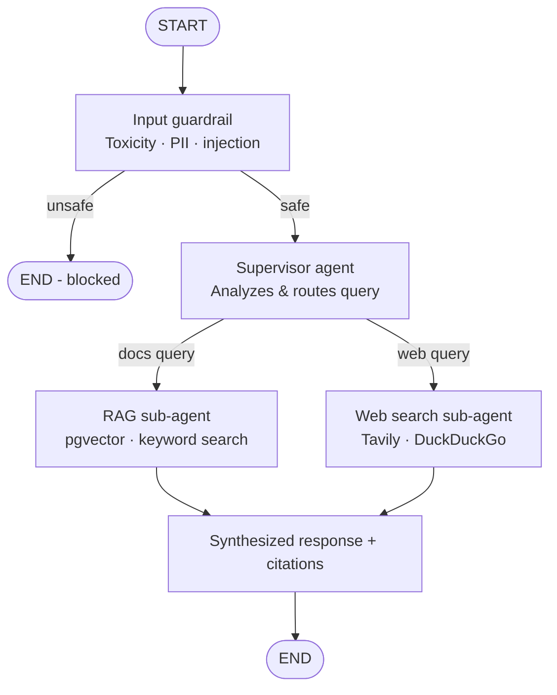

🤖 Multi-Modal RAG Application

A production-deployed, agentic RAG system built and validated as a Proof of Concept at the workplace.

This project is a full-stack, multi-modal Retrieval-Augmented Generation (RAG) application designed to let teams query their internal documents using natural language. Built with a LangGraph multi-agent supervisor at its core, the system intelligently routes queries between project-specific document search and live web search — then synthesizes results into cited, context-aware responses.
The backend (FastAPI + Celery + Redis) is fully containerized with Docker and was deployed to AWS ECS via ECR. The frontend (Next.js + Clerk) is hosted on Vercel, with Supabase serving as the managed vector database in production. LangSmith provides end-to-end agent trace observability across the entire pipeline.
Key capabilities: multi-agent coordination · hybrid vector + keyword retrieval · multi-modal ingestion (PDFs, images, tables, web) · async document processing · input guardrails · citation tracking · RAGAS evaluation

